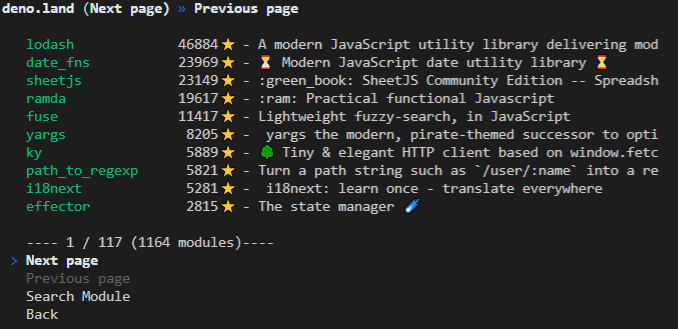

# Kopo Cli 🐶

*A Deno registry browser in the terminal*

[](https://deno.land/x/kopo)
[](https://nest.land/package/kopo)



## Description

`kopo` is a tool, which helps you browse the Deno registries in your terminal, search for a specific module.

It currently supports `deno.land/x` and `x.nest.land`.

## Usage

Run from the url:

```bash
deno run --unstable --allow-net https://deno.land/x/kopo@v0.0.3/mod.ts
```

or install it like:

```bash
deno install --unstable --allow-net -f https://deno.land/x/kopo@v0.0.3/mod.ts kopo
```

## Features

Features depend on the capabilities of the browsed module repository.

#### deno.land/x

- Browse a paginated list of the modules
- Search through the modules with a keyword
- Display basic information about the module
- Show the raw README of the module, if one exists in the module's repo
- Show the parsed flags from the README if provided.

#### x.nest.land

- Browse a paginated list of the modules
- Search through the modules with a keyword
- Display basic information about the module
- Show the raw README of the module, if one exists in the module's repo
- Show the parsed flags from the README if provided.

### 🚩 Flags

> 🚧 This is just an experimental feature currently 🚧

This proposes a concept, where each module describes what its required and optional flags are in a parseable way.

#### How it works

The parser is [here](./flag_parser.ts)

Currently it searches for markdown table rows, which contain 2 or 3 columns.

- The first column needs to contain the flag inside backticks like ( `--unstable` ). Things can be before it in the column, but only spaces are allowed after it.
- The second column indicates, whether the flag is required (`*`, `Yes` or `yes`) or optional (empty). Putting `_` in this column tells the parser to ignore the row.
- The optional third column can serve as a description why the flag is needed.

A table could look something like this:

|Flag| Required |Reason|
|:--|:-:|:--|
| 🚧 `--unstable`  | * | Needed for [Cliffy](https://github.com/c4spar/deno-cliffy) to work |
| 🌐 `--allow-net` | * | To fetch data from the repos |
| 🔍 `--allow-read` | _ | Needed for cache info |
| 💾 `--allow-write` | _ | Save favourites |
| ⏱ `--allow-hrtime` | _ | Allows precise benchmarking |
| ⚠ `--allow-run` | _ | Needed for feature x |
| 🧭 `--allow-env` | _ | Needed to access your ENV |
| 🧩 `--allow-plugin` | _ | Needed to use RUST plugins |
| 🔮 `--allow-all` | _ | It should never be required |

#### Testing your file for flags

There is a small util that you can use to test your file for the flags. It can be found [here](./flag_checker.ts).

To use it simply run:

```bash
deno run --allow-read https://deno.land/x/kopo@v0.0.3/flag_checker.ts ./README.md
```

or for remote files:

```bash
deno run --allow-net https://deno.land/x/kopo@v0.0.3/flag_checker.ts https://raw.githubusercontent.com/littletof/kopo-cli/master/README.md
```

## Contribution

Issues, pull requests and feedback are always welcome.

## Licence

Copyright 2020- Szalay Kristóf. All rights reserved. MIT license.
