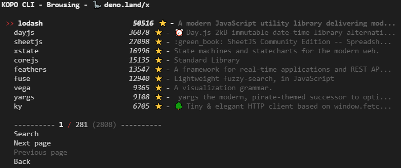
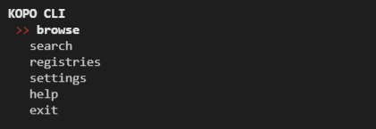
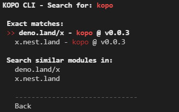
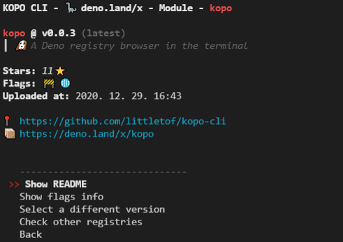
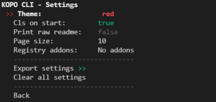

# Kopo Cli 🐶

*A Deno registry browser in the terminal*

[](https://deno.land/x/kopo)
[](https://nest.land/package/kopo)



## Description

`kopo` is a cli tool, which helps you browse the Deno registries in your terminal in an easy, nicely presented way.

It supports `deno.land/x` and `x.nest.land` by default, but also enables you to use [addons](#registries-and-addons), to access different registries.

## Usage

`kopo` is intended to be as an installed user script. For that, run:

```bash
deno install --unstable --allow-net -f --name kopo --location https://kopo.mod.land https://deno.land/x/kopo@v0.0.3/mod.ts
```

<!-- TODO different entry point, ? cli.ts ? -->

To just try it out, run the following command:

```bash
deno run --unstable --allow-net --location https://kopo.mod.land https://deno.land/x/kopo@v0.0.3/mod.ts
```

## Features

- browse the registries
- search through registries for a keyword/specific module
- get a specific module's info, eg: description, stars, repo, versions, readme
- print a module's readme as a formatted markdown text with [charmd](https://deno.land/x/charmd)
- show what [flags](#-flags) a module requires
- An addon system, to access private or not yet added registries.
- Persisted settings, like theme, disabled registries, other preferences + export, import of it

`kopo`'s features can be accessed in two may separate ways.

- Use it as an interactive application with a menu system
- Issue simple commands and get only what you need in the cli

## As an app

If installed with the command above, you simply need to issue the `kopo` command in your terminal, than the main menu should appear:



After that, you can navigate the menu using the <kbd>&#8593;</kbd> <kbd>&#8595;</kbd> or <kbd>w</kbd> <kbd>s</kbd> buttons. (On windows you can't use the arrows currently :/ [issue](https://github.com/denoland/deno/issues/5945))

### Browse

Select one from the enabled registries, than browse the paginated modules list or search for a term.


### Search

Issue a global search in all registries.



Use the `@` and a version to search for a specific version, like `kopo@v0.0.2`.
If the search term isn't a modules name, you can search the registries for that term with the options at the bottom.

### Module info

After you select a module, you will see it's info:



From here, you can print it's README as a formatted MarkDown(using [charmd](https://github.com/littletof/charmd)) if one was found for it, get details about its [flags](#-flags), see other versions of it or see which other registries have this module registered.

### Settings
If the `--location` flag was provided, you can access the settings, where you can tailor some features to your likings:



## As a `CLI` tool

> 🚧 The API needs work, so it's bound to be changed 🚧

### Search

Your starting point is:
```bash
kopo search
```
Without any following parameters, the search menu will pop up for you.

If you want to search for a specific search term eg `charmd` issue:
```bash
kopo search charmd
```

If you know the module's name you are searching for add `--exact` or `-e` flag.
```bash
kopo search kopo -e
```
This will get the first exact match from the first registry and display the modules info for you. Also, if you have `-e` you can add `--readme` or `--read-raw` so the modules **README** will be printed instead.
```bash
kopo search charmd -e --readme
```
Adding `--flags` will print the module's [flags](#-flags) described in the readme if found.
```bash
kopo search kopo -e --flags
```

Adding `--json` flag for any of the above commands, will result in a formatted json output, instead of formatted text.
```bash
kopo search charmd -e --json
```

### Settings
You can export or import your settings which are stored in localStorage.
Keep in mind, that this needs `--allow-read` and `--allow-write` flags, so you need to install it with these flags, or run the script with `deno run`

```bash
deno run --location https://kopo.mod.land --unstable --allow-write mod.ts settings export settings.json
deno run --location https://kopo.mod.land --unstable --allow-read mod.ts settings import settings.json
```

## Registries and Addons

Currently `deno.land/x` and `x.nest.land` is supported by default. However, you can use addons to integrate with other, not yet supported or private registries.

For this, first you need to have path (remote or local) to the registry addon, which should `extend` the [`Registry`](./registries/registry.ts) class. ([example](./examples/example_registry_addon.ts))

With that, you can add this path to your exported settings json and import it back into the app or use the `-r` flag for any of the commands.
<details>
<summary>settings.json</summary>

```json
[
    {
        "key": "registry_addons",
        "value": [
            "https://raw.githubusercontent.com/littletof/kopo-cli/remaster/examples/example_registry_addon.ts"
        ]
    }
]
```

</details>

This flag will override which registries `kopo` will use during its runtime.
```bash
kopo -r deno,nest,https://raw.githubusercontent.com/littletof/kopo-cli/remaster/examples/example_registry_addon.ts
```
> Use `file:///` prefix for any local files: `file:///C:/example.ts`

If the `-r` flag is used, no registry, that is not defined will be accessible.
Also, if `-r` is not used, you can enable/disable your builtin and through settings added registries in the application.

### 🚩 Flags

> 🚧 This is just an experimental feature currently 🚧

This proposes a concept, where each module describes what its required and optional flags are in a parseable way.

#### How it works

The parser is [here](./flag_parser.ts)

Currently it searches for markdown table rows, which contain 2 or 3 columns.

- The first column needs to contain the flag inside backticks like ( `--unstable` ). Things can be before it in the column, but only spaces are allowed after it.
- The second column indicates, whether the flag is required (`*`, `Yes` or `yes`) or optional (empty). Putting `_` in this column tells the parser to ignore the row.
- The optional third column can serve as a description why the flag is needed.

A table could look something like this:

|Flag| Required |Reason|
|:--|:-:|:--|
| 🚧 `--unstable`  | * | Needed for [Cliffy](https://github.com/c4spar/deno-cliffy) to work |
| 🌐 `--allow-net` | * | To fetch data from the repos |
| 🔰 `--location` |   | To save settings. `https://kopo.mod.land` |
| 🔍 `--allow-read` | _ | Needed for cache info |
| 💾 `--allow-write` | _ | Save favourites |
| ⏱ `--allow-hrtime` | _ | Allows precise benchmarking |
| ⚠ `--allow-run` | _ | Needed for feature x |
| 🧭 `--allow-env` | _ | Needed to access your ENV |
| 🧩 `--allow-plugin` | _ | Needed to use RUST plugins |
| 🔮 `--allow-all` | _ | It should never be required |

> Also keep in mind, that you can hide this inside a comment is you dont find a proper place for it in your readme, inside the `<!--` `-->` tags, but than only the tools processing your readme can see it.

#### Testing your file for flags

There is a small util that you can use to test your file for the flags. It can be found [here](./flag_checker.ts).

To use it simply run:

```bash
deno run --allow-read https://deno.land/x/kopo@v0.0.3/flag_checker.ts ./README.md
```

or for remote files:

```bash
deno run --allow-net https://deno.land/x/kopo@v0.0.3/flag_checker.ts https://raw.githubusercontent.com/littletof/kopo-cli/master/README.md
```

## Contribution

Issues, pull requests and feedback are always welcome.

## Licence

Copyright 2020- Szalay Kristóf. All rights reserved. MIT license.
